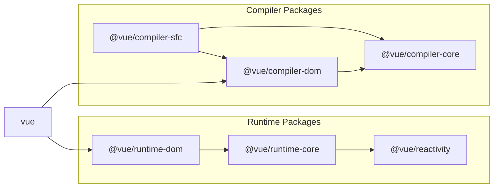

# 简易的模板编译器

## 实际上，目前我们需要实现的东西大致都已经完成了(?)

到目前为止，我们已经实现了 Reactivity System 响应式系统、Virtual DOM 虚拟 DOM 和 Component 组件系统。
虽然已实现的这些内容都很简单并且不是很实用，但是毫不夸张的说，我们对 Vue.js 的整体已经有了大致的了解。
每个部分都缺乏完整的功能，给我们的感觉就像刚刚要接近终点的位置，但始终没有达到终点一样。

所以从本章开始，我们将实现模板功能，让它更加接近 Vue.js。当然这些只是为了改进 DX（Developer Experience），并不会影响运行时的内容。
更具体地说，我们将扩展开发者使用接口以改进 DX，并“最终将其转换为我们迄今为止所做的内部实现支持的结构”。

> 译者注：DX 概念可以参考 [What Is DX? (Developer Experience)](https://medium.com/swlh/what-is-dx-developer-experience-401a0e44a9d9)

## 这次想要实现的开发者接口

现在我们完成的是这样的开发者界面。

```ts
const MyComponent: Component = {
  props: { someMessage: { type: String } },

  setup(props: any, { emit }: any) {
    return () =>
      h('div', {}, [
        h('p', {}, [`someMessage: ${props.someMessage}`]),
        h('button', { onClick: () => emit('click:change-message') }, [
          'change message',
        ]),
      ])
  },
}

const app = createApp({
  setup() {
    const state = reactive({ message: 'hello' })
    const changeMessage = () => {
      state.message += '!'
    }

    return () =>
      h('div', { id: 'my-app' }, [
        h(
          MyComponent,
          {
            'some-message': state.message,
            'onClick:change-message': changeMessage,
          },
          [],
        ),
      ])
  },
})
```

目前，View 视图部分是使用 `h` 函数构建的。为了更接近原始的 HTML 的写法，我想在 template 选项中编写 HTML 格式的模板。

话虽如此，如果我们一次性实现各种功能是很困难的，所以稍微缩减一下功能来完成。

总之，我们分成以下的任务进行。

1. 能够绘制简单的标签、消息和静态属性

```ts
const app = createApp({ template: `<p class="hello">Hello World</p>` })
```

2. 能够渲染复杂一些的 HTML 内容

```ts
const app = createApp({
  template: `
    <div>
      <p>hello</p>
      <button> click me! </button>
    </div>
  `,
})
```

3. 能够使用 `setup` 函数中定义的内容。

```ts
const app = createApp({
  setup() {
    const count = ref(0)
    const increment = () => {
      count.value++
    }

    return { count, increment }
  },

  template: `
    <div>
      <p>count: {{ count }}</p>
      <button v-on:click="increment"> click me! </button>
    </div>
  `,
})
```

在后面的实现过程中我还会细分成更小的步骤，但是这里我将它大致分为这三个部分。

现在，我们从 1 开始吧。

## 实现模板编译器的第一步

现在，我们要实现的开发者界面如下。

```ts
const app = createApp({ template: `<p class="hello">Hello World</p>` })
```

首先，我们先理解一下“编译器”到底是什么。

当我们编写软件时，有可能会听到“编译器”这个词。“编译”的意思也可以理解为“翻译”，在软件开发领域，通常用来表示“从高层语法描述转化为低层的语法描述的转化过程”。

你还记得本书开头的这句话吗？

> 为图简便，我将其称为“**低级开发者接口**”，因为它更加接近于原生的 JS。
> 当然这也是最重要的一部分，需要“从最基础的低级接口的实现开始”。
> 因为在很多情况下，高级语法都需要被转化成低级语法。
> 也就是说，1 和 2 最终也会被转换成 3 的形式，这部分转化功能，被称为 **编译器**。

现在我们应该就能理解为什么需要这个编译器了吧，它的一大目的就是“改善开发体验”。毕竟就算没有编译器，我们也已经提供了一个可用的“低级”开发者接口，开发者也可以用这些功能来进行开发。

但是在实现编译器时，如果我们考虑进去很多与功能无关的部分，那就会导致文档描述很难理解，或者使用上非常麻烦和繁琐，出现各种问题。

因此我们也要考虑开发者的感受，只开发关于界面的部分。

对此，Vue.js 的目标就是“像写原生的 HTML 一样，并且可以灵活使用 Vue 提供的功能 (指令等) 更方便地编写 View 视图”。
并且，最终的目标就是实现 SFC。

虽然，现在随着 jsx/tsx 的流行，Vue 也提供了类似的开发者选项。
但是，这次我依然想在 Vue 如何实现 template 解析的方向上尝试一下。

这章我用了很长的篇幅来解释了我想做的事情。

就像这样的代码：

```ts
const app = createApp({ template: `<p class="hello">Hello World</p>` })
```

我想实现一个这样的翻译（编译）功能，也就是翻译为这样的结果。

```ts
const app = createApp({
  render() {
    return h('p', { class: 'hello' }, ['Hello World'])
  },
})
```

如果你想把范围再缩小一点，这就是这部分。

```ts
;`<p class="hello">Hello World</p>`
// ↓
h('p', { class: 'hello' }, ['Hello World'])
```

我们分几个阶段来逐步实现。

## 尝试实现简易编译器。

## 实现方式

基础思想是通过操作 `template` 模板选项中传递的字符串来生成特定的函数。

让我们将编译器的实现分为三个部分。

### 解析

解析(`parse`)方法，负责从传递的字符串中分析所需的信息。如果您能得到如下所示的结果就差不多了。

```ts
const { tag, props, textContent } = parse(`<p class="hello">Hello World</p>`)
console.log(tag) // "p"
console.log(prop) // { class: "hello" }
console.log(textContent) // "Hello World"
```

### 代码生成

代码生成(`codegen`)方法负责根据 `parse` 的结果生成代码 (字符串)。

```ts
const code = codegen({ tag, props, textContent })
console.log(code) // "h('p', { class: 'hello' }, ['Hello World']);"
```

### 函数对象生成

根据 `codegen` 生成的代码 (字符串) 生成实际可执行的函数。
在 JavaScript 中，可以通过使用 Function 构造函数从字符串生成函数。

```ts
const f = new Function('return 1')
console.log(f()) // 1

// 这样定义参数
const add = new Function('a', 'b', 'return a + b')
console.log(add(1, 1)) // 2
```

我们可以利用这个来生成函数。

这里有一点需要注意，生成的函数只能处理参数中定义的变量，`h` 函数等的读取也包含在这个对象中。

```ts
import * as runtimeDom from './runtime-dom'
const render = new Function('ChibiVue', code)(runtimeDom)
```

这样的话，因为我们使用了 `ChibiVue` 这个名字来接收了 `runtimeDom` 导出的所有内容，所以在 `codegen` 的阶段可以直接使用如下的方式获取 `h` 函数。

```ts
const code = codegen({ tag, props, textContent })
console.log(code) // "return () => { const { h } = ChibiVue; return h('p', { class: 'hello' }, ['Hello World']); }"
```

也就是说，刚才的

```ts
;`<p class="hello">Hello World</p>`
// ↓
h('p', { class: 'hello' }, ['Hello World'])
```

更准确的说，我们需要的是实现这样的内容

```ts
;`<p class="hello">Hello World</p>`

// ↓

ChibiVue => {
  return () => {
    const { h } = ChibiVue
    return h('p', { class: 'hello' }, ['Hello World'])
  }
}
```

转换为接收 `runtimeDom` 来生成 `render` 渲染函数对应的字符串。

`codegen` 函数的职责就是

```ts
const code = `
  return () => {
      const { h } = ChibiVue;
      return h("p", { class: "hello" }, ["Hello World"]);
  };
`
```

生成函数字符串。

## 实现

既然理清了思路，我们就开始实现吧。

首先在 `~/packages` 的目录中创建一个 `compiler-core` 的目录，并且在目录下创建 `index.ts`、 `parse.ts`、 `codegen.ts` 三个文件。

```sh
pwd # ~/
mkdir packages/compiler-core
touch packages/compiler-core/index.ts
touch packages/compiler-core/parse.ts
touch packages/compiler-core/codegen.ts
```

index.ts 如之前的说明一样，仅用于 export 导出。

那么我们先从 `parse` 函数开始吧~ `packages/compiler-core/parse.ts`：

```ts
export const baseParse = (
  content: string,
): { tag: string; props: Record<string, string>; textContent: string } => {
  const matched = content.match(/<(\w+)\s+([^>]*)>([^<]*)<\/\1>/)
  if (!matched) return { tag: '', props: {}, textContent: '' }

  const [_, tag, attrs, textContent] = matched

  const props: Record<string, string> = {}
  attrs.replace(/(\w+)=["']([^"']*)["']/g, (_, key: string, value: string) => {
    props[key] = value
    return ''
  })

  return { tag, props, textContent }
}
```

虽然是使用正则表达式的非常简单的解析器，但作为首次实现已经足够了。

接下来是代码生成函数。我们在 codegen.ts 中实现。`packages/compiler-core/codegen.ts`：

```ts
export const generate = ({
  tag,
  props,
  textContent,
}: {
  tag: string
  props: Record<string, string>
  textContent: string
}): string => {
  return `return () => {
  const { h } = ChibiVue;
  return h("${tag}", { ${Object.entries(props)
    .map(([k, v]) => `${k}: "${v}"`)
    .join(', ')} }, ["${textContent}"]);
}`
}
```

那么，将它们组合起来就可以实现从 `template` 字符串生成渲染函数字符串的函数了。
我们创建一个新的文件 `packages/compiler-core/compile.ts`。

`packages/compiler-core/compile.ts` 的内容：

```ts
import { generate } from './codegen'
import { baseParse } from './parse'

export function baseCompile(template: string) {
  const parseResult = baseParse(template)
  const code = generate(parseResult)
  return code
}
```

我想这部分不是特别难。其实，`compiler-core` 部分的职责就到此为止了。

## 运行时编译器和构建过程中的编译器

实际上 Vue 有两种类型的编译器。

有些在运行时（在浏览器中）运行，有些在构建过程（例如 Node.js）上运行。

运行时编译器负责编译 `template` 模板选项或以 HTML 形式提供的模板，而构建过程编译器负责编译 SFC（或 JSX）。

我们当前正在实现的模板选项编译属于前一类。

```ts
const app = createApp({ template: `<p class="hello">Hello World</p>` })
app.mount('#app')
```

```html
<div id="app"></div>
```

或者是一个以 HTML 形式提供模板选项的“开发者界面”，您可以在其中使用 HTML 编写 Vue 模板（方便通过 CDN 等方式快速合并渲染内容到原 HTML 中）。

```ts
const app = createApp()
app.mount('#app')
```

```html
<div id="app">
  <p class="hello">Hello World</p>
  <button @click="() => alert('hello')">click me!</button>
</div>
```

这两种方式都需要将 template 模板进行编译，但是编译过程是在浏览器上进行的。

另一方面，则是发生在工程构建时的 SFC 文件编译，运行时部分只存在编译后的代码。（开发环境需要准备 Vite、Webpack 等打包工具）

```vue
<!-- App.vue -->
<script>
export default {}
</script>

<template>
  <p class="hello">Hello World</p>
  <button @click="() => alert("hello")">click me!</button>
</template>
```

```ts
import App from 'App.vue'
const app = createApp(App)
app.mount('#app')
```

```html
<div id="app"></div>
```

但是，值得注意的是无论是哪种编译，核心处理逻辑都是通用的。

也就是我们在 `compiler-core` 中实现的这部分公共代码。

运行时编译器和 SFC 编译器分别在目录 `compiler-dom` 和 `compiler-sfc` 中实现。

请看下图。



https://github.com/vuejs/core/blob/main/.github/contributing.md#package-dependencies

## 继续实现

刚刚讨论多了一点，现在我们接着实现后面的内容。

考虑到我们刚才说过我们现在实现的是运行时的编译器，所以我们创建一个 `compiler-dom` 目录更好一点。

```sh
pwd # ~/
mkdir packages/compiler-dom
touch packages/compiler-dom/index.ts
```

`packages/compiler-dom/index.ts` 的实现。

```ts
import { baseCompile } from '../compiler-core'

export function compile(template: string) {
  return baseCompile(template)
}
```

现在你可能会想“嗯，这样的话只是 `codegen` 代码生成而已。函数的生成该怎么办？”

其实最后的函数不是在这里生成的，而是在 `package/index.ts` 中完成的（源代码中的 [packages/vue/src/index.ts](https://github.com/vuejs/core/blob/main/packages/vue/src/index.ts)）。

我们后面会实现 `package/index.ts`，但是现在需要做一些准备工作。

首先在 `package/runtime-core/component.ts` 创建一个变量用来保存编译器对象，并实现一个注册函数用来注册编译器对象。

`package/runtime-core/component.ts`

```ts
type CompileFunction = (template: string) => InternalRenderFunction
let compile: CompileFunction | undefined

export function registerRuntimeCompiler(_compile: any) {
  compile = _compile
}
```

现在，让我们在 package/index.ts 创建一个编译器并注册它。

```ts
import { compile } from './compiler-dom'
import { InternalRenderFunction, registerRuntimeCompiler } from './runtime-core'
import * as runtimeDom from './runtime-dom'

function compileToFunction(template: string): InternalRenderFunction {
  const code = compile(template)
  return new Function('ChibiVue', code)(runtimeDom)
}

registerRuntimeCompiler(compileToFunction)

export * from './runtime-core'
export * from './runtime-dom'
export * from './reactivity'
```

※ `runtime-dom` 必须要包含 `h` 函数，所以不要忘记在 `runtime-dom` 导出它。

```ts
export { h } from '../runtime-core'
```

现在编译器已经注册好了，我想实际用它来编译一下。

但是组件的选项中如果没有 `template` 的话是无法进入模板编译的，所以我们需要先把 `template` 定义好。

```ts
export type ComponentOptions = {
  props?: Record<string, any>
  setup?: (
    props: Record<string, any>,
    ctx: { emit: (event: string, ...args: any[]) => void },
  ) => Function
  render?: Function
  template?: string // 追加
}
```

最重要的就是编译了，所以我们还需要稍微重构一下 `renderer` 渲染器。

```ts
const mountComponent = (initialVNode: VNode, container: RendererElement) => {
  const instance: ComponentInternalInstance = (initialVNode.component =
    createComponentInstance(initialVNode))

  // ----------------------- 从这里开始
  const { props } = instance.vnode
  initProps(instance, props)
  const component = initialVNode.type as Component
  if (component.setup) {
    instance.render = component.setup(instance.props, {
      emit: instance.emit,
    }) as InternalRenderFunction
  }
  // ----------------------- 到此结束

  setupRenderEffect(instance, initialVNode, container)
}
```

将上面的 `mountComponent` 方法提取到 `package/runtime-core/component.ts` 中。

`package/runtime-core/component.ts`：

```ts
export const setupComponent = (instance: ComponentInternalInstance) => {
  const { props } = instance.vnode
  initProps(instance, props)

  const component = instance.type as Component
  if (component.setup) {
    instance.render = component.setup(instance.props, {
      emit: instance.emit,
    }) as InternalRenderFunction
  }
}
```

`package/runtime-core/renderer.ts`

```ts
const mountComponent = (initialVNode: VNode, container: RendererElement) => {
  // prettier-ignore
  const instance: ComponentInternalInstance = (initialVNode.component = createComponentInstance(initialVNode));
  setupComponent(instance)
  setupRenderEffect(instance, initialVNode, container)
}
```

然后，我们在 `setupComponent` 函数中来运行编译器进行模板编译。

```ts
export const setupComponent = (instance: ComponentInternalInstance) => {
  const { props } = instance.vnode
  initProps(instance, props)

  const component = instance.type as Component
  if (component.setup) {
    instance.render = component.setup(instance.props, {
      emit: instance.emit,
    }) as InternalRenderFunction
  }

  // ------------------------ 这里
  if (compile && !component.render) {
    const template = component.template ?? ''
    if (template) {
      instance.render = compile(template)
    }
  }
}
```

现在我们应该能够编译模板选项中传递的简单 HTML 字符串了。让我们在 Playground 上尝试一下！

```ts
const app = createApp({ template: `<p class="hello">Hello World</p>` })
app.mount('#app')
```


看起来运行良好。

如果结构一样的话，应该可以编译，所以我们来尝试一下，看看能否生效。

```ts
const app = createApp({
  template: `<b class="hello" style="color: red;">Hello World!!</b>`,
})
app.mount('#app')
```


看起来已经实现了！

当前源代码位于:  
[chibivue (GitHub)](https://github.com/Ubugeeei/chibivue/tree/main/book/impls/10_minimum_example/060_template_compiler)
