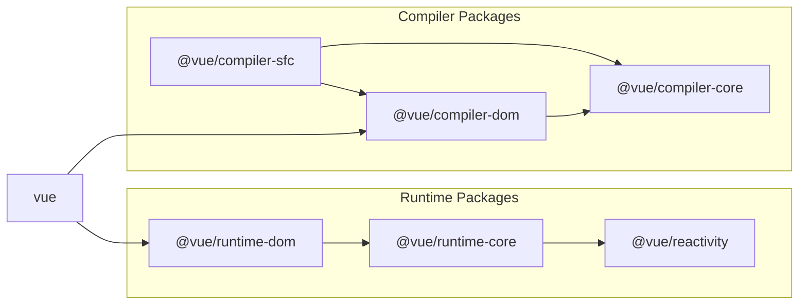

# 实现模板编译器

## 实现方法

基本的方法是处理template选项中传递的字符串，生成特定的函数。  
我们将编译器分为三个部分。

### 解析

解析(parse)从传递的字符串中提取必要的信息。  
以下是一个简单的例子：

```ts
const { tag, props, textContent } = parse(`<p class="hello">Hello World</p>`)
console.log(tag) // "p"
console.log(prop) // { class: "hello" }
console.log(textContent) // "Hello World"
```

### 代码生成

代码生成(codegen)基于parse的结果生成代码(字符串)。

```ts
const code = codegen({ tag, props, textContent })
console.log(code) // "h('p', { class: 'hello' }, ['Hello World']);"
```

### 函数对象生成

基于codegen生成的代码(字符串)，创建实际可执行的函数。  
在JavaScript中，我们可以使用Function构造函数从字符串生成函数。

```ts
const f = new Function('return 1')
console.log(f()) // 1

// 如果需要定义参数，可以这样做
const add = new Function('a', 'b', 'return a + b')
console.log(add(1, 1)) // 2
```

我们将使用这个方法生成函数。  
这里有一点需要注意，生成的函数只能处理在其中定义的变量，所以我们需要包含h函数等的导入。

```ts
import * as runtimeDom from './runtime-dom'
const render = new Function('ChibiVue', code)(runtimeDom)
```

这样，我们可以用ChibiVue这个名称接收runtimeDom，所以在codegen阶段需要提前准备好h函数的导入方式：

```ts
const code = codegen({ tag, props, textContent })
console.log(code) // "return () => { const { h } = ChibiVue; return h('p', { class: 'hello' }, ['Hello World']); }"
```

也就是说，我们之前提到的转换：

```ts
`<p class="hello">Hello World</p>`
// ↓
h('p', { class: 'hello' }, ['Hello World'])
```

更准确地说，应该是：

```ts
`<p class="hello">Hello World</p>`

// ↓

ChibiVue => {
  return () => {
    const { h } = ChibiVue
    return h('p', { class: 'hello' }, ['Hello World'])
  }
}
```

我们将这个结果传递给runtimeDom，生成render函数。  
而codegen的职责是生成如下字符串：

```ts
const code = `
  return () => {
      const { h } = ChibiVue;
      return h("p", { class: "hello" }, ["Hello World"]);
  };
`
```

## 实现

理解了方法后，让我们开始实现。在`~/packages`目录中创建`compiler-core`目录，并在其中创建`index.ts`、`parse.ts`和`codegen.ts`文件。

```sh
pwd # ~/
mkdir packages/compiler-core
touch packages/compiler-core/index.ts
touch packages/compiler-core/parse.ts
touch packages/compiler-core/codegen.ts
```

index.ts像往常一样仅用于导出。

让我们从parse开始实现。  
`packages/compiler-core/parse.ts`

```ts
export const baseParse = (
  content: string,
): { tag: string; props: Record<string, string>; textContent: string } => {
  const matched = content.match(/<(\w+)\s+([^>]*)>([^<]*)<\/\1>/)
  if (!matched) return { tag: '', props: {}, textContent: '' }

  const [_, tag, attrs, textContent] = matched

  const props: Record<string, string> = {}
  attrs.replace(/(\w+)=["']([^"']*)["']/g, (_, key: string, value: string) => {
    props[key] = value
    return ''
  })

  return { tag, props, textContent }
}
```

虽然这是一个使用正则表达式的非常简单的解析器，但作为第一次实现已经足够了。

接下来，是代码生成。在codegen.ts中实现。  
`packages/compiler-core/codegen.ts`

```ts
export const generate = ({
  tag,
  props,
  textContent,
}: {
  tag: string
  props: Record<string, string>
  textContent: string
}): string => {
  return `return () => {
  const { h } = ChibiVue;
  return h("${tag}", { ${Object.entries(props)
    .map(([k, v]) => `${k}: "${v}"`)
    .join(', ')} }, ["${textContent}"]);
}`
}
```

现在，我们将这些结合起来，实现一个从template生成函数字符串的函数。创建一个新文件`packages/compiler-core/compile.ts`。  
`packages/compiler-core/compile.ts`

```ts
import { generate } from './codegen'
import { baseParse } from './parse'

export function baseCompile(template: string) {
  const parseResult = baseParse(template)
  const code = generate(parseResult)
  return code
}
```

这应该不太难理解。实际上，compiler-core的职责就到此为止。

## 运行时编译器和构建过程编译器

Vue实际上有两种类型的编译器。  
一种是在运行时(浏览器中)执行的编译器，另一种是在构建过程(如Node.js环境)中执行的编译器。  
具体来说，运行时编译器处理template选项或作为HTML提供的模板，而构建过程编译器处理SFC(单文件组件)或JSX。  
template选项就是我们现在正在实现的内容。

```ts
const app = createApp({ template: `<p class="hello">Hello World</p>` })
app.mount('#app')
```

```html
<div id="app"></div>
```

作为HTML提供的模板是指在HTML中直接编写Vue模板的开发者接口。(通过CDN引入时很方便快速地嵌入到HTML中。)

```ts
const app = createApp()
app.mount('#app')
```

```html
<div id="app">
  <p class="hello">Hello World</p>
  <button @click="() => alert('hello')">click me!</button>
</div>
```

这两种情况都需要编译模板，而编译过程发生在浏览器中。

另一方面，SFC的编译是在项目构建时进行的，运行时环境中只存在编译后的代码。(开发环境需要配置vite或webpack等打包工具。)

```vue
<!-- App.vue -->
<script>
export default {}
</script>

<template>
  <p class="hello">Hello World</p>
  <button @click="() => alert("hello")">click me!</button>
</template>
```

```ts
import App from 'App.vue'
const app = createApp(App)
app.mount('#app')
```

```html
<div id="app"></div>
```

值得注意的是，无论哪种编译器，都有共同的处理部分。  
实现这些共同部分的源代码位于`compiler-core`目录中。  
而运行时编译器和SFC编译器分别实现在`compiler-dom`和`compiler-sfc`目录中。  
请在此时回顾一下这张图：



https://github.com/vuejs/core/blob/main/.github/contributing.md#package-dependencies

## 继续实现

刚才我们有点跑题了，让我们继续实现编译器。  
考虑到前面的讨论，我们现在创建的是运行时编译器，所以应该创建`compiler-dom`目录。

```sh
pwd # ~/
mkdir packages/compiler-dom
touch packages/compiler-dom/index.ts
```

在`packages/compiler-dom/index.ts`中实现代码。

```ts
import { baseCompile } from '../compiler-core'

export function compile(template: string) {
  return baseCompile(template)
}
```

你可能会想："啊？这不是只做了代码生成吗？函数的生成在哪里？"  
实际上，在这里我们也没有生成函数，而是在`packages/index.ts`中进行。(在Vue源码中，对应的是[packages/vue/src/index.ts](https://github.com/vuejs/core/blob/main/packages/vue/src/index.ts))

在实现`packages/index.ts`之前，我们需要做一些准备工作。  
这个准备工作是在`packages/runtime-core/component.ts`中添加一个保存编译器本身的变量和注册用的函数。

`packages/runtime-core/component.ts`

```ts
type CompileFunction = (template: string) => InternalRenderFunction
let compile: CompileFunction | undefined

export function registerRuntimeCompiler(_compile: any) {
  compile = _compile
}
```

现在，让我们在`packages/index.ts`中生成函数并注册它。

```ts
import { compile } from './compiler-dom'
import { InternalRenderFunction, registerRuntimeCompiler } from './runtime-core'
import * as runtimeDom from './runtime-dom'

function compileToFunction(template: string): InternalRenderFunction {
  const code = compile(template)
  return new Function('ChibiVue', code)(runtimeDom)
}

registerRuntimeCompiler(compileToFunction)

export * from './runtime-core'
export * from './runtime-dom'
export * from './reactivity'
```

※ 由于runtimeDom需要包含h函数，所以别忘了在`runtime-dom`中导出它。

```ts
export { h } from '../runtime-core'
```

现在我们已经注册了编译器，接下来要实际执行编译。  
首先，我们需要在组件选项的类型中添加template字段。

```ts
export type ComponentOptions = {
  props?: Record<string, any>
  setup?: (
    props: Record<string, any>,
    ctx: { emit: (event: string, ...args: any[]) => void },
  ) => Function
  render?: Function
  template?: string // 添加
}
```

对于核心的编译部分，我们需要对渲染器进行一些重构。

```ts
const mountComponent = (initialVNode: VNode, container: RendererElement) => {
  const instance: ComponentInternalInstance = (initialVNode.component =
    createComponentInstance(initialVNode))

  // ----------------------- 从这里
  const { props } = instance.vnode
  initProps(instance, props)
  const component = initialVNode.type as Component
  if (component.setup) {
    instance.render = component.setup(instance.props, {
      emit: instance.emit,
    }) as InternalRenderFunction
  }
  // ----------------------- 到这里

  setupRenderEffect(instance, initialVNode, container)
}
```

我们将上面`mountComponent`中的部分提取到`packages/runtime-core/component.ts`中。

`packages/runtime-core/component.ts`

```ts
export const setupComponent = (instance: ComponentInternalInstance) => {
  const { props } = instance.vnode
  initProps(instance, props)

  const component = instance.type as Component
  if (component.setup) {
    instance.render = component.setup(instance.props, {
      emit: instance.emit,
    }) as InternalRenderFunction
  }
}
```

`packages/runtime-core/renderer.ts`

```ts
const mountComponent = (initialVNode: VNode, container: RendererElement) => {
  // prettier-ignore
  const instance: ComponentInternalInstance = (initialVNode.component = createComponentInstance(initialVNode));
  setupComponent(instance)
  setupRenderEffect(instance, initialVNode, container)
}
```

现在，让我们在setupComponent中执行编译。

```ts
export const setupComponent = (instance: ComponentInternalInstance) => {
  const { props } = instance.vnode
  initProps(instance, props)

  const component = instance.type as Component
  if (component.setup) {
    instance.render = component.setup(instance.props, {
      emit: instance.emit,
    }) as InternalRenderFunction
  }

  // ------------------------ 这里
  if (compile && !component.render) {
    const template = component.template ?? ''
    if (template) {
      instance.render = compile(template)
    }
  }
}
```

现在我们应该能够编译通过template选项传递的简单HTML了，让我们在playground中测试一下！

```ts
const app = createApp({ template: `<p class="hello">Hello World</p>` })
app.mount('#app')
```


看起来运行得很好。只要结构相同，就应该能够编译，让我们修改一下看看是否能够正确反映。

```ts
const app = createApp({
  template: `<b class="hello" style="color: red;">Hello World!!</b>`,
})
app.mount('#app')
```


看来我们的实现正常工作了！

到目前为止的源代码：  
[chibivue (GitHub)](https://github.com/chibivue-land/chibivue/tree/main/book/impls/10_minimum_example/060_template_compiler)
