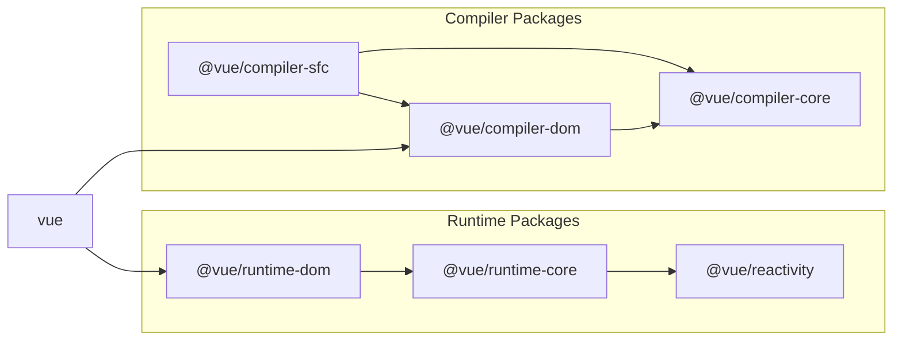

# 希望用 SFC(单文件组件) 开发

## SFC 该怎么实现呢？

## 目标

从现在开始，我们终于要准备支持 SFC(Single File Component) 单文件组件的实现了。

那么，我们应该如何去实现它呢？
SFC 和模板一样，只是在开发的时候使用的，在实际的运行时中是不存在的。
但是对于那些已经实现过模板解析的人来说，我认为很容易就能知道需要编译什么以及如何编译。

SFC 的使用如下：

```vue
<script>
export default {
  setup() {
    const state = reactive({ message: 'Hello, chibivue!' })
    const changeMessage = () => {
      state.message += '!'
    }

    return { state, changeMessage }
  },
}
</script>

<template>
  <div class="container" style="text-align: center">
    <h2>message: {{ state.message }}</h2>
    
    <p><b>chibivue</b> is the minimal Vue.js</p>

    <button @click="changeMessage">click me!</button>
  </div>
</template>

<style>
.container {
  height: 100vh;
  padding: 16px;
  background-color: #becdbe;
  color: #2c3e50;
}
</style>
```

我们将它转换成如下的 JS 代码即可。

```ts
export default {
  setup() {
    const state = reactive({ message: 'Hello, chibivue!' })
    const changeMessage = () => {
      state.message += '!'
    }

    return { state, changeMessage }
  },

  render(_ctx) {
    return h('div', { class: 'container', style: 'text-align: center' }, [
      h('h2', `message: ${_ctx.state.message}`),
      h('img', {
        width: '150px',
        src: 'https://upload.wikimedia.org/wikipedia/commons/thumb/9/95/Vue.js_Logo_2.svg/1200px-Vue.js_Logo_2.svg.png',
      }),
      h('p', [h('b', 'chibivue'), ' is the minimal Vue.js']),
      h('button', { onClick: _ctx.changeMessage }, 'click me!'),
    ])
  },
}
```

(样式（style）怎么处理!? 很多人可能会有这个疑问，但是我们现在先忽略这一点，专注于 template 与 script。)

## 我该什么时候编译以及如何编译它？

结论就是“在当构建工具在解析处理依赖关系的时候我们开始进行解析和编译”。
因为大多数情况下，SFC 是通过其他文件 import 导入来进行使用的。
这时，我们需要编写一个构建工具的插件，在解析到 `.vue` 这样的文件时将其编译并将结果绑定到 `App` 上。

```ts
import App from './App.vue' // 读取 App.vue 的时候对 App.vue 进行编译

const app = createApp(App)
app.mount('#app')
```

构建工具有很多种，但是这次我们主要为 Vite 编写一个插件。

我想有很多人还从来没有编写过 Vite 插件，所以通过一个简单的示例来学习如何编写一个 Vite 插件。

现在我们先创建一个简单的 Vue 项目。

```sh
pwd # ~
pnpx create-vite
## ✔ Project name: … plugin-sample
## ✔ Select a framework: › Vue
## ✔ Select a variant: › TypeScript

cd plugin-sample
ni
```

让我们看一下刚刚创建的项目中的 `vite.config.ts` 文件。

```ts
import { defineConfig } from 'vite'
import vue from '@vitejs/plugin-vue'

// https://vitejs.dev/config/
export default defineConfig({
  plugins: [vue()],
})
```

可以看到在 `plugin` 插件选项中添加了一个 `@vitejs/plugin-vue` 的插件。

事实上，这就是为什么我用 Vite 创建 Vue 项目时能直接使用 SFC 的原因。

该插件有一个根据 Vite 提供的插件 API 实现的 SFC 编译器，能够将 `.vue` 文件编译为 JS 文件。

让我们用这个项目创建一个简单的插件。

```ts
import { defineConfig, Plugin } from 'vite'
import vue from '@vitejs/plugin-vue'

// https://vitejs.dev/config/
export default defineConfig({
  plugins: [vue(), myPlugin()],
})

function myPlugin(): Plugin {
  return {
    name: 'vite:my-plugin',

    transform(code, id) {
      if (id.endsWith('.sample.js')) {
        let result = ''

        for (let i = 0; i < 100; i++) {
          result += `console.log("HelloWorld from plugin! (${i})");\n`
        }

        result += code

        return { code: result }
      }
    },
  }
}
```

我创建了一个名为 `myPlugin` 的插件。
这个代码很简单，我想大部分人应该都能看懂，但是我这里还是要解释一下。

该插件符合 Vite 插件的基本要求。但是由于这只是一个简单示例，所以我只使用了 `transform` 选项。
至于其他的内容，我想还是直接看官方文档要好一点。
https://vitejs.dev/guide/api-plugin.html

`transform` 选项是个函数，接收 `code` 和 `id` 两个参数。
你可以将 `code` 视为文件内容，将 `id` 视为文件名。至于转换结果，你可以将它放在返回值对象中作为 `code` 属性。
然后根据 `id` 判断不同的文件类型来进行不同的处理，或者通过修改 `code` 返回值来重写文件内容。

这次，我们尝试为 `*.sample.js` 这种命名格式的文件，在文件开头添加 100 次 `console` 打印。

现在，让我们编写一个 `plugin.sample.js` 的文件来检查一下它是否正常工作。

```sh
pwd # ~/plugin-sample
touch src/plugin.sample.js
```

`~/plugin-sample/src/plugin.sample.js`

```ts
function fizzbuzz(n) {
  for (let i = 1; i <= n; i++) {
    i % 3 === 0 && i % 5 === 0
      ? console.log('fizzbuzz')
      : i % 3 === 0
        ? console.log('fizz')
        : i % 5 === 0
          ? console.log('buzz')
          : console.log(i)
  }
}

fizzbuzz(Math.floor(Math.random() * 100) + 1)
```

`~/plugin-sample/src/main.ts`

```ts
import { createApp } from 'vue'
import './style.css'
import App from './App.vue'
import './plugin.sample.js' // 追加

createApp(App).mount('#app')
```

让我们在浏览器中确认一下。

```sh
pwd # ~/plugin-sample
nr dev
```


可以看到源代码确实已经被修改了。

当前源代码位于:  
[chibivue (GitHub)](https://github.com/Ubugeeei/chibivue/tree/main/book/impls/10_minimum_example/070_sfc_compiler)

## 实现 SFC 编译器

## 准备

这是我之前创建的示例插件，但现在我们不再需要它了，所以我们将其删除掉。

```sh
pwd # ~
rm -rf ./plugin-sample
```

这是插件的主体，但由于这本来就超出了 vuejs/core （核心功能）的范围，所以我们将在 `~/packages` 中创建一个名为 `@extensions` 的目录并在那里实现它。

```sh
pwd # ~
mkdir -p packages/@extensions/vite-plugin-chibivue
touch packages/@extensions/vite-plugin-chibivue/index.ts
```

`~/packages/@extensions/vite-plugin-chibivue/index.ts`

```ts
import type { Plugin } from 'vite'

export default function vitePluginChibivue(): Plugin {
  return {
    name: 'vite:chibivue',

    transform(code, id) {
      return { code }
    },
  }
}
```

现在，我们来实现 SFC 编译器。
然而，如果没有任何实质内容我们会很难想象出插件的运行效果，
所以让我们实现一个 playground 并在运行它，与我们的开发同时进行。

我们创建一个简单的 SFC 文件然后加载它。

```sh
pwd # ~
touch examples/playground/src/App.vue
```

`examples/playground/src/App.vue`

```vue
<script>
import { reactive } from 'chibivue'
export default {
  setup() {
    const state = reactive({ message: 'Hello, chibivue!', input: '' })

    const changeMessage = () => {
      state.message += '!'
    }

    const handleInput = e => {
      state.input = e.target?.value ?? ''
    }

    return { state, changeMessage, handleInput }
  },
}
</script>

<template>
  <div class="container" style="text-align: center">
    <h2>{{ state.message }}</h2>
    
    <p><b>chibivue</b> is the minimal Vue.js</p>

    <button @click="changeMessage">click me!</button>

    <br />

    <label>
      Input Data
      <input @input="handleInput" />
    </label>

    <p>input value: {{ state.input }}</p>
  </div>
</template>

<style>
.container {
  height: 100vh;
  padding: 16px;
  background-color: #becdbe;
  color: #2c3e50;
}
</style>
```

`playground/src/main.ts`

```ts
import { createApp } from 'chibivue'
import App from './App.vue'

const app = createApp(App)

app.mount('#app')
```

`playground/vite.config.js`

```ts
import path from 'node:path'
import { fileURLToPath } from 'node:url'
import { defineConfig } from 'vite'

import chibivue from '../../packages/@extensions/vite-plugin-chibivue'

const dirname = path.dirname(fileURLToPath(new URL(import.meta.url)))

export default defineConfig({
  resolve: {
    alias: {
      chibivue: path.resolve(dirname, '../../packages'),
    },
  },
  plugins: [chibivue()],
})
```

让我们就这样尝试运行一下。


报错了对吧？但是这是正常的。

## 解决这个错误

我们并不需要立马就追求最完美的实现，现在首要的应该是怎么解决这个报错。

首先，我们将插件的转换文件目标限制为 `*.vue`，你可以像我刚刚的示例插件那样通过 `id` 来判断文件类型。但是实际上 Vite 提供了一个 `createFilter` 工具函数，因此我这里将用它来创建一个 `filter` 过滤器，用来直接筛选 `.vue` 文件（这部分也没有什么特别的原因，本质上都是差不多的）。

`~/packages/@extensions/vite-plugin-chibivue/index.ts`

```ts
import type { Plugin } from 'vite'
import { createFilter } from 'vite'

export default function vitePluginChibivue(): Plugin {
  const filter = createFilter(/\.vue$/)

  return {
    name: 'vite:chibivue',

    transform(code, id) {
      if (!filter(id)) return
      return { code: `export default {}` }
    },
  }
}
```

现在我们创建了一个过滤器，用来筛选 `.vue` 文件，然后插件会将内容替换为 `export default {}`。

现在屏幕上的错误应该就会消失了，整个屏幕会变成空白画面。

## 在 compiler-sfc 中实现编译器

当然，上面那种方式只是一个临时方式，现在，我们开始正式实现 SFC 编译器。

vite-plugin 的作用就是在使用 Vite 时，能够利用 Vite 的能力进行 `transform` 转换 vue 文件。
所以解析器和编译器一样都在 vue 源码的 `packages` 里面。

SFC 编译器是一个名为 `compiler-sfc` 的文件目录。



https://github.com/vuejs/core/blob/main/.github/contributing.md#package-dependencies

无论是 Vite 还是 Webpack，SFC 编译器的核心逻辑部分都是一样的。他们都在 `compiler-sfc` 中实现。

所以我们创建一个 `compiler-sfc` 目录。

```sh
pwd # ~
mkdir packages/compiler-sfc
touch packages/compiler-sfc/index.ts
```

在编译 SFC 的过程中，用 `SFCDescriptor` 类型的对象来表示 SFC 文件。

```sh
touch packages/compiler-sfc/parse.ts
```

`packages/compiler-sfc/parse.ts`

```ts
import { SourceLocation } from '../compiler-core'

export interface SFCDescriptor {
  id: string
  filename: string
  source: string
  template: SFCTemplateBlock | null
  script: SFCScriptBlock | null
  styles: SFCStyleBlock[]
}

export interface SFCBlock {
  type: string
  content: string
  loc: SourceLocation
}

export interface SFCTemplateBlock extends SFCBlock {
  type: 'template'
}

export interface SFCScriptBlock extends SFCBlock {
  type: 'script'
}

export declare interface SFCStyleBlock extends SFCBlock {
  type: 'style'
}
```

这部分应该不难，只是将 SFC 的内容和信息表示成一个 JS 对象。

`packages/compiler-sfc/parse.ts` 将 SFC 文件（字符串）解析为 `SFCDescriptor` 。

现在可能有人会想：“我在之前的模板解析器的实现上已经花了很大的功夫，现在又需要创建一个解析器，这不是很麻烦吗？”
但是实际上我们不需要担心，因为这个解析器也没什么大不了的。

因为这个解析器的实现并不是很困难，因为我们只需要根据之前编写的内容来重新组合一下，然后分离出 `template` 模板、`script` 脚本与 `style` 样式三个部分。

首先，作为前提条件，我们需要导出之前编写的 `template` 对应的模板解析器。

`~/packages/compiler-dom/index.ts`

```ts
import { baseCompile, baseParse } from '../compiler-core'

export function compile(template: string) {
  return baseCompile(template)
}

// 导出解析函数
export function parse(template: string) {
  return baseParse(template)
}
```

然后在 `compiler-sfc` 文件下记录这些导出内容对应的 `interface` 定义。

```sh
pwd # ~
touch packages/compiler-sfc/compileTemplate.ts
```

`~/packages/compiler-sfc/compileTemplate.ts`

```ts
import { TemplateChildNode } from '../compiler-core'

export interface TemplateCompiler {
  compile(template: string): string
  parse(template: string): { children: TemplateChildNode[] }
}
```

接下来就是实现 SFC 解析器了。

`packages/compiler-sfc/parse.ts`

```ts
import { ElementNode, NodeTypes, SourceLocation } from '../compiler-core'
import * as CompilerDOM from '../compiler-dom'
import { TemplateCompiler } from './compileTemplate'

/**
 * =========
 * 省略之前的部分
 * =========
 */

export interface SFCParseOptions {
  filename?: string
  sourceRoot?: string
  compiler?: TemplateCompiler
}

export interface SFCParseResult {
  descriptor: SFCDescriptor
}

export const DEFAULT_FILENAME = 'anonymous.vue'

export function parse(
  source: string,
  { filename = DEFAULT_FILENAME, compiler = CompilerDOM }: SFCParseOptions = {},
): SFCParseResult {
  const descriptor: SFCDescriptor = {
    id: undefined!,
    filename,
    source,
    template: null,
    script: null,
    styles: [],
  }

  const ast = compiler.parse(source)
  ast.children.forEach(node => {
    if (node.type !== NodeTypes.ELEMENT) return

    switch (node.tag) {
      case 'template': {
        descriptor.template = createBlock(node, source) as SFCTemplateBlock
        break
      }
      case 'script': {
        const scriptBlock = createBlock(node, source) as SFCScriptBlock
        descriptor.script = scriptBlock
        break
      }
      case 'style': {
        descriptor.styles.push(createBlock(node, source) as SFCStyleBlock)
        break
      }
      default: {
        break
      }
    }
  })

  return { descriptor }
}

function createBlock(node: ElementNode, source: string): SFCBlock {
  const type = node.tag

  let { start, end } = node.loc
  start = node.children[0].loc.start
  end = node.children[node.children.length - 1].loc.end
  const content = source.slice(start.offset, end.offset)

  const loc = { source: content, start, end }
  const block: SFCBlock = { type, content, loc }

  return block
}
```

到目前为止，我想对于自己实现过模板解析器的人来说应该都很容易。

让我们在插件中尝试一下解析 SFC 吧。

`~/packages/@extensions/vite-plugin-chibivue/index.ts`

```ts
import { parse } from '../../compiler-sfc'

export default function vitePluginChibivue(): Plugin {
  //.
  //.
  //.
  return {
    //.
    //.
    //.
    transform(code, id) {
      if (!filter(id)) return
      const { descriptor } = parse(code, { filename: id })
      console.log(
        '🚀 ~ file: index.ts:14 ~ transform ~ descriptor:',
        descriptor,
      )
      return { code: `export default {}` }
    },
  }
}
```

这段代码在 vite 对应的进程下运行的，也就是在 node 环境中，所以此时的 console 应该输出到终端（terminal）中。


/_ 省略中间部分 _/


看来你做到了！我们已经解析成功了。

当前源代码位于:  [chibivue (GitHub)](https://github.com/Ubugeeei/chibivue/tree/main/book/impls/10_minimum_example/070_sfc_compiler2)

## template 模板部分编译

在上面编写的 `parse` 函数返回值中，`descriptor.script.content` 和 `descriptor.template.content` 分别包含了 `script` 标签部分与 `template` 标签部分的源代码。
我们现在希望的是能够成功编译它们。

首先我们从 `template` 部分开始。

我们之前已经有了一个模板编译器。但是，从下面的代码中你会发现，

```ts
export const generate = ({
  children,
}: {
  children: TemplateChildNode[]
}): string => {
  return `return function render(_ctx) {
  with (_ctx) {
    const { h } = ChibiVue;
    return ${genNode(children[0])};
  }
}`
}
```

之前的实现是假设它会与 `Function` 构造函数一起使用，所以开头是一个 `return` 语句。

但是在 SFC 编译器中，我只想生成一个渲染函数 `render`，所以我们可以在 `compile` 编译器函数中添加一个参数来进行判断。

现在我们修改 `compile` 函数，允许接收第二个参数，并指定为 `isBrowser`，是一个布尔值。

当 `isBrowser` 为 `true` 时，生成提供给运行时使用的代码，否则就只是简单的生成代码。

```sh
pwd # ~
touch packages/compiler-core/options.ts
```

`packages/compiler-core/options.ts`

```ts
export type CompilerOptions = {
  isBrowser?: boolean
}
```

`~/packages/compiler-dom/index.ts`

```ts
export function compile(template: string, option?: CompilerOptions) {
  const defaultOption: Required<CompilerOptions> = { isBrowser: true }
  if (option) Object.assign(defaultOption, option)
  return baseCompile(template, defaultOption)
}
```

`~/packages/compiler-core/compile.ts`

```ts
export function baseCompile(
  template: string,
  option: Required<CompilerOptions>,
) {
  const parseResult = baseParse(template.trim())
  const code = generate(parseResult, option)
  return code
}
```

`~/packages/compiler-core/codegen.ts`

```ts
export const generate = (
  {
    children,
  }: {
    children: TemplateChildNode[]
  },
  option: Required<CompilerOptions>,
): string => {
  return `${option.isBrowser ? 'return ' : ''}function render(_ctx) {
  const { h } = ChibiVue;
  return ${genNode(children[0])};
}`
}
```

还需要对刚才的插件进行修改，这里我导入了 `Plugin` 类型声明，并且声明了一个 `outputs` 数组变量，以便将所有编译结果进行输出

```ts
import type { Plugin } from 'vite'
import { createFilter } from 'vite'
import { parse } from '../../compiler-sfc'
import { compile } from '../../compiler-dom'

export default function vitePluginChibivue(): Plugin {
  const filter = createFilter(/\.vue$/)

  return {
    name: 'vite:chibivue',

    transform(code, id) {
      if (!filter(id)) return

      const outputs = []
      outputs.push("import * as ChibiVue from 'chibivue'\n")

      const { descriptor } = parse(code, { filename: id })
      const templateCode = compile(descriptor.template?.content ?? '', {
        isBrowser: false,
      })
      outputs.push(templateCode)

      outputs.push('\n')
      outputs.push(`export default { render }`)

      return { code: outputs.join('\n') }
    },
  }
}
```

现在我们应该能够编译 `template` 为一个 `render` 函数了，我们可以在浏览器中检查一下源代码。

但是，实际上现在还有一点儿小问题。

目前我们实现模板的数据绑定时使用的是 `with` 语句，但是由于 ESM 的特性，Vite 是无法处理仅仅能够在非严格模式（sloppy 模式）下才能执行的代码。
也就是说它无法处理 `with` 语句。

到现在为止，我们实现的编译只是简单的生成一个包含 `with` 语句的代码（字符串）然后将其传递给 `Function` 构造函数，然后生成可以在浏览器上执行的函数，这看起来没有什么特别的问题。

但这种实现方式是有问题的，现在它就会抛出这样的错误。

> Strict mode code may not include a with statement
> 
> 即：严格模式代码不能包含 with 语句

关于这个问题，Vite 的官方文档也将其记录到了排错指南当中。

[出现 Syntax Error 或 Type Error(Vite)](https://cn.vitejs.dev/guide/troubleshooting#syntax-error-type-error-happens)

作为临时解决方案，让我们尝试在非浏览器模式下生成不包含 `with` 语句的代码。

具体来说，对于要绑定的数据，我们尝试通过添加实例对象前缀 `_ctx.` 来控制，而不是使用 `with` 语句。

当然由于这只是一个临时方式，所以代码实现上不会特别严格，但是我认为它应该能正常使用。
（正确的解决方案会在后面的章节中讲解）

```ts
export const generate = (
  {
    children,
  }: {
    children: TemplateChildNode[]
  },
  option: Required<CompilerOptions>,
): string => {
  // 如果 isBrowser 为 false，则生成不包含 with 语句的代码
  return `${option.isBrowser ? 'return ' : ''}function render(_ctx) {
    ${option.isBrowser ? 'with (_ctx) {' : ''}
      const { h } = ChibiVue;
      return ${genNode(children[0], option)};
    ${option.isBrowser ? '}' : ''}
}`
}

// .
// .
// .

const genProp = (
  prop: AttributeNode | DirectiveNode,
  option: Required<CompilerOptions>,
): string => {
  switch (prop.type) {
    case NodeTypes.ATTRIBUTE:
      return `${prop.name}: "${prop.value?.content}"`
    case NodeTypes.DIRECTIVE: {
      switch (prop.name) {
        case 'on':
          return `${toHandlerKey(prop.arg)}: ${
            option.isBrowser ? '' : '_ctx.' // -------------------- 这里
          }${prop.exp}`
        default:
          // TODO: other directives
          throw new Error(`unexpected directive name. got "${prop.name}"`)
      }
    }
    default:
      throw new Error(`unexpected prop type.`)
  }
}

// .
// .
// .

const genInterpolation = (
  node: InterpolationNode,
  option: Required<CompilerOptions>,
): string => {
  return `${option.isBrowser ? '' : '_ctx.'}${node.content}` // ------------ 这里
}
```


看起来编译效果还不错。对于 `script` 部分我们要做的处理也是类似的，将内容部分通过某种方式转换后按照这样的方式放到 `default exports` 默认导出中就好了。

当前源代码位于: [chibivue (GitHub)](https://github.com/Ubugeeei/chibivue/tree/main/book/impls/10_minimum_example/070_sfc_compiler3)

## script 脚本部分编译

现在，原始的 `script` 部分获取到的内容是这样的格式：

```ts
export default {
  setup() {},
}
```

我想将它和刚刚生成的 `render` 函数结合起来然后一起导出他们。但是我只需要这部分。

```ts
{
  setup() {},
}
```

怎么把这部分取出来呢？

如果我们能把上面那部分取出来，就可以直接这么操作了。

```ts
const _sfc_main = {
  setup() {},
}

export default { ..._sfc_main, render }
```

## 使用外部库

要实现上面的效果，我们只需要用以下两个库就可以轻松实现了。

- @babel/parser
- magic-string

### Babel

https://babeljs.io

[What is Babel](https://babeljs.io/docs)

对于经常使用 JavaScript 的人来说，这应该是一个非常常见的问题。
Babel 是一个用来将 JavaScript 代码转换为向后兼容版本的工具链。
简单来说，它是一个 JS 到 JS 的编译器（transpiler）。

这次我们不仅会将 Babel 用到编译器，还会将它用到解析器上。
但由于 Babel 本身也作为一个编译器，内部实现了一个解析器用来转换为 AST。
我们也可以直接利用它来解析。

之前我们也说过 AST，表示抽象语法树。它在 JavaScript 中也有自己的表述方式。

您可以在这里(https://github.com/estree/estree)找到 AST 的规范。
你可以自行查看 Github 上面的 md 文档来了解这个规范，但是我这里还是要简单解释一下。

首先，整个程序由一个名为 `Program` 的 AST 节点表示根节点，其中包含 `Statements` 数组（为了便于理解，表述为 `TS` 接口）。

```ts
interface Program {
  body: Statement[]
}
```

`Statement` 在 JavaScript 中表示 “语句”，`body` 是语句的集合。
示例中包括 “变量声明语句”、“`if` 语句”、“`for` 语句” 和 “块语句”。

```ts
interface Statement {}

interface VariableDeclaration extends Statement {
  /* 省略 */
}

interface IfStatement extends Statement {
  /* 省略 */
}

interface ForStatement extends Statement {
  /* 省略 */
}

interface BlockStatement extends Statement {
  body: Statement[]
}
// 还有很多其他的语句
```

而且在很多情况下，语句通常都是 `Expression` 表达式。
表达式一般指用来分配变量的内容，具体的包括 “对象”、“二元运算”、“函数调用” 等。

```ts
interface Expression {}

interface BinaryExpression extends Expression {
  operator: '+' | '-' | '*' | '/' // 还有很多其他的操作符，这里省略掉了
  left: Expression
  right: Expression
}

interface ObjectExpression extends Expression {
  properties: Property[] // 省略
}

interface CallExpression extends Expression {
  callee: Expression
  arguments: Expression[]
}

// 还有很多其他的
```

我们思考一下 `if` 语句，可以知道它应该具有以下结构：

```ts
interface IfStatement extends Statement {
  test: Expression // 条件表达式
  consequent: Statement // 条件表达式结构为 true 时执行的语句
  alternate: Statement | null // 条件表达式结构为 false 时执行的语句
}
```

这样，JavaScript 语法就被解析为像上面那样的 AST。
我认为对于那些已经实现了 chibivue 模板编译器的人来说这不分会很容易理解（原理是相同的）。

我之所以使用 Babel 来实现，原因有两个：
1. 它的使用很简单，假设我们要自己实现一个完整的解析器，如果您有开发解析器的经验，加上阅读 estree 了解 AST 规范，这样在技术上来说还是可行的。
2. 另一个原因就是 Vue 在这个地方也使用了 Babel。

### magic-string

https://github.com/rich-harris/magic-string

我使用的另外一个库，也是 Vue 所使用的。

它的目的是让字符串的操作更加方便。

```ts
const input = 'Hello'
const s = new MagicString(input)
```

创建一个这样的 `MagicString` 实例，我们可以使用该实例上的方法来便捷地操作字符串。
这里有些使用示例。

```ts
s.append('!!!') // 末尾追加字符
s.prepend('message: ') // 头部插入字符
s.overwrite(9, 13, 'Hello') // 指定范围内替换
```

虽然看起来没有必要强行使用，但是这也是为了和 Vue 源码保持一致。

无论是 Babel 还是 magic-string，此时你都不需要详细了解实际用法。
稍后我会解释它们的用途并调整代码实现，现在对它们有一个粗略的了解就可以了。

## 重写 script 脚本的默认导出

回顾一下之前的目标：

```ts
export default {
  setup() {},
  // 其他内容
}
```

将上面这样的源码

```ts
const _sfc_main = {
  setup() {},
  // 其他内容
}

export default { ..._sfc_main, render }
```

重写为这个样子。

换句话说，我们的目标就是能够从原始代码中的 `export default` 导出语句中提取导出的内容并将其分配给名为 `_sfc_main` 的变量。

首先，先安装必要的库。

```sh
pwd # ~
ni @babel/parser magic-string
```

创建一个名为 `rewriteDefault.ts` 的文件。

```sh
pwd # ~
touch packages/compiler-sfc/rewriteDefault.ts
```

创建一个 `rewriteDefault` 函数，指定参数 `input` 为接收的原始代码，`as` 为要解释编译内容的变量名。
最后返回转换后的代码字符串。

`~/packages/compiler-sfc/rewriteDefault.ts`

```ts
export function rewriteDefault(input: string, as: string): string {
  // TODO:
  return ''
}
```

首先，我们要处理不存在默认导出的情况。由于没有 `export` 导出，所以要给 `as` 指定的变量绑定一个空对象。

```ts
const defaultExportRE = /((?:^|\n|;)\s*)export(\s*)default/
const namedDefaultExportRE = /((?:^|\n|;)\s*)export(.+)(?:as)?(\s*)default/s

export function rewriteDefault(input: string, as: string): string {
  if (!hasDefaultExport(input)) {
    return input + `\nconst ${as} = {}`
  }

  // TODO:
  return ''
}

export function hasDefaultExport(input: string): boolean {
  return defaultExportRE.test(input) || namedDefaultExportRE.test(input)
}
```

现在就轮到 Babel 和 magic-string 登场了。

```ts
import { parse } from '@babel/parser'
import MagicString from 'magic-string'
// .
// .
export function hasDefaultExport(input: string): boolean {
  // .
  // .
  const s = new MagicString(input)
  const ast = parse(input, {
    sourceType: 'module',
  }).program.body
  // .
  // .
}
```

从这里开始，我们将根据 Babel 的解析器解析原始代码得到的 JavaScript AST（也就是 `ast` 变量）通过 `s` 对原始代码字符串进行操作。

这部分代码有点儿长，但是我会在代码中给出足够的文字说明。
基本上我们要做的就是遍历 `ast`，根据不同的 `Statement` 语句类型编写不同的分支处理，然后使用 `s` 提供的方法操作代码字符串。

```ts
export function hasDefaultExport(input: string): boolean {
  // .
  // .
  ast.forEach(node => {
    // 具有 default export 的情况
    if (node.type === 'ExportDefaultDeclaration') {
      if (node.declaration.type === 'ClassDeclaration') {
        // 如果是 `export default class Hoge {}`，则替换为 `class Hoge {}`
        s.overwrite(node.start!, node.declaration.id.start!, `class `)
        // 在此基础上，在末尾追加 `const ${as} = Hoge;` 代码就可以了。
        s.append(`\nconst ${as} = ${node.declaration.id.name}`)
      } else {
        // 除此之外，将 default export 部分替换为变量声明即可。
        // eg 1) `export default { setup() {}, }`  ->  `const ${as} = { setup() {}, }`
        // eg 2) `export default Hoge`  ->  `const ${as} = Hoge`
        s.overwrite(node.start!, node.declaration.start!, `const ${as} = `)
      }
    }

    // 在具名导出的情况下，也可能存在默认导出
    // 主要有以下三种情况
    //   1. `export { default } from "source";` 的情况
    //   2. `export { hoge as default }` from 'source' 的情况
    //   3. `export { hoge as default }` 的情况
    if (node.type === 'ExportNamedDeclaration') {
      for (const specifier of node.specifiers) {
        if (
          specifier.type === 'ExportSpecifier' &&
          specifier.exported.type === 'Identifier' &&
          specifier.exported.name === 'default'
        ) {
          // 如果有 `form` 关键字
          if (node.source) {
            if (specifier.local.name === 'default') {
              // 1. `export { default } from "source";` 的情况
              // 在这种情况下，需要将其提取到导入语句中并为其重新命名，然后将其绑定到最终的 `as` 变量。
              // eg) `export { default } from "source";`
              // ->  `import { default as __VUE_DEFAULT__ } from 'source'; const ${as} = __VUE_DEFAULT__`
              const end = specifierEnd(input, specifier.local.end!, node.end!)
              s.prepend(
                `import { default as __VUE_DEFAULT__ } from '${node.source.value}'\n`,
              )
              s.overwrite(specifier.start!, end, ``)
              s.append(`\nconst ${as} = __VUE_DEFAULT__`)
              continue
            } else {
              // 2. `export { hoge as default }` from 'source' 的情况
              // 在这种情况下，需要按照导入语句中的方式重写所有变量标识符，并将作为 default 默认值的变量绑定到最终的 `as` 变量。
              // eg) `export { hoge as default } from "source";`
              // ->  `import { hoge } from 'source'; const ${as} = hoge
              const end = specifierEnd(
                input,
                specifier.exported.end!,
                node.end!,
              )
              s.prepend(
                `import { ${input.slice(
                  specifier.local.start!,
                  specifier.local.end!,
                )} } from '${node.source.value}'\n`,
              )

              // 3. `export { hoge as default }` 的情况
              // 在这种情况下，我们只需要简单地把默认变量绑定到最终的 `as` 变量
              s.overwrite(specifier.start!, end, ``)
              s.append(`\nconst ${as} = ${specifier.local.name}`)
              continue
            }
          }
          const end = specifierEnd(input, specifier.end!, node.end!)
          s.overwrite(specifier.start!, end, ``)
          s.append(`\nconst ${as} = ${specifier.local.name}`)
        }
      }
    }
  })
  // .
  // .
}

// 计算声明语句的结尾位置
function specifierEnd(input: string, end: number, nodeEnd: number | null): number {
  // export { default   , foo } ...
  let hasCommas = false
  let oldEnd = end
  while (end < nodeEnd!) {
    if (/\s/.test(input.charAt(end))) {
      end++
    } else if (input.charAt(end) === ',') {
      end++
      hasCommas = true
      break
    } else if (input.charAt(end) === '}') {
      break
    }
  }
  return hasCommas ? end : oldEnd
}
```

现在我们已经可以重写默认导出语句。让我们尝试在插件中使用它。

```ts
import type { Plugin } from 'vite'
import { createFilter } from 'vite'
import { parse, rewriteDefault } from '../../compiler-sfc'
import { compile } from '../../compiler-dom'

export default function vitePluginChibivue(): Plugin {
  const filter = createFilter(/\.vue$/)

  return {
    name: 'vite:chibivue',

    transform(code, id) {
      if (!filter(id)) return

      const outputs = []
      outputs.push("import * as ChibiVue from 'chibivue'")

      const { descriptor } = parse(code, { filename: id })

      // --------------------------- 从这里开始
      const SFC_MAIN = '_sfc_main'
      const scriptCode = rewriteDefault(
        descriptor.script?.content ?? '',
        SFC_MAIN,
      )
      outputs.push(scriptCode)
      // --------------------------- 到这里结束

      const templateCode = compile(descriptor.template?.content ?? '', {
        isBrowser: false,
      })
      outputs.push(templateCode)

      outputs.push('\n')
      outputs.push(`export default { ...${SFC_MAIN}, render }`) // 这里打印结果

      return { code: outputs.join('\n') }
    },
  }
}
```

在此之前，我们要先做一个小修改。

`~/packages/runtime-core/component.ts`

```ts
export const setupComponent = (instance: ComponentInternalInstance) => {
  // .
  // .
  // .
  // 将 component 组件定义中的 render 函数绑定到组件实例上
  const { render } = component
  if (render) {
    instance.render = render as InternalRenderFunction
  }
}
```

现在应该能够渲染了！


由于我们还没有处理 `style` 样式部分，所以编写的样式没有生效，但是元素渲染已经没有问题了。

## style 样式块

### Virtual Modules 虚拟模块

我们也支持样式文件。在 Vite 中，您可以使用 `.css` 扩展名导入 CSS 文件。

```js
import 'app.css'
```

我们将使用 Vite 的虚拟模块来实现这个功能。它可以从 SFC 中创建一个虚拟的 CSS 文件，并通过将它添加到输入语句中的导入语句中来完成对它的引用。

刚听到 “虚拟模块” 这个词，可能会觉得实现起来很困难，但如果我们能理解成 “实际上不存在的文件，但是保存在内存中可以作为实际存在的文件一样使用” 应该就没问题了。

在 Vite 中，我们可以使用 `load` 和 `resolve` 选项来实现虚拟模块。

```ts
export default function myPlugin() {
  const virtualModuleId = 'virtual:my-module'

  return {
    name: 'my-plugin', // 必须设置 name，不然会出现错误和警告
    resolveId(id) {
      if (id === virtualModuleId) {
        return virtualModuleId
      }
    },
    load(id) {
      if (id === virtualModuleId) {
        return `export const msg = "from virtual module"`
      }
    },
  }
}
```

通过在 `resolve` 中任意设置所需的模块的 ID 并在 `load` 中处理该 ID，您就可以加载该模块。

例如上面的例子中，`virtual:my-module` 模块就是不存在的。

```ts
import { msg } from 'virtual:my-module'
```

但是我们按照上面这种方式来编写代码，则会被编译成 `export const msg = "from virtual module"` 然后加载这个虚拟模块。

[参考文档](https://cn.vitejs.dev/guide/api-plugin#virtual-modules-convention)

我们可以借助这个机制来将 SFC 中的 `style` 部分转换为 css 虚拟模块然后加载。

正如之前所说，vite 只需导入扩展名为 css 的文件就可以使用，所以我们需要考虑为每个 SFC 创建名为 `${SFC 的文件名}.css` 的虚拟模块。

### 使用 SFC 中样式块的内容实现虚拟模块

例如这次，如果我们有一个名为 `App.vue` 的文件，让我们思考一下为它的 `style` 样式部分创建一个虚拟模块。

我们要做的很简单：当我们读取一个名为 `**.vue.css` 的文件时，我们将从除 `.css` 之外的文件路径（即普通 `.vue` 文件）中获取 SFC，并使用 `fs.readFileSync` 读取文件中 `style` 块的内容，最后将其作为 `code` 返回。

```ts
export default function vitePluginChibivue(): Plugin {
  //  ,
  //  ,
  //  ,
  return {
    //  ,
    //  ,
    //  ,
    resolveId(id) {
      // 这个 id 实际上是一个不存在的路径，但是需要在 load 中作为虚拟模块处理，所以返回 id 字符串 (可以读取)
      if (id.match(/\.vue\.css$/)) return id

      // 对于在此处没有被返回的 id，如果文件实际存在，则将解析该文件；如果不存在，则将抛出文件不存在的错误
    },
    load(id) {
      // 当 .vue.css 文件被加载时 (有 import 声明的导入语句) 进行处理
      if (id.match(/\.vue\.css$/)) {
        const filename = id.replace(/\.css$/, '')
        const content = fs.readFileSync(filename, 'utf-8') // 正常获取 SFC 文件
        const { descriptor } = parse(content, { filename }) //  解析 SFC

        // 将所有 styles 块组合返回
        const styles = descriptor.styles.map(it => it.content).join('\n')
        return { code: styles }
      }
    },

    transform(code, id) {
      if (!filter(id)) return

      const outputs = []
      outputs.push("import * as ChibiVue from 'chibivue'")
      outputs.push(`import '${id}.css'`) // 插入 ${id}.css 对应的导入声明
      //  ,
      //  ,
      //  ,
    },
  }
}
```

现在，让我们在浏览器中检查一下。


看起来样式已经正常应用了。

在浏览器中，您可以看到 CSS 已经导入和加载了，并且生成了一个虚拟的 `.vue.css` 文件。

  


现在我们已经可以正常使用 SFC 了。

当前源代码位于: [chibivue (GitHub)](https://github.com/Ubugeeei/chibivue/tree/main/book/impls/10_minimum_example/070_sfc_compiler4)
