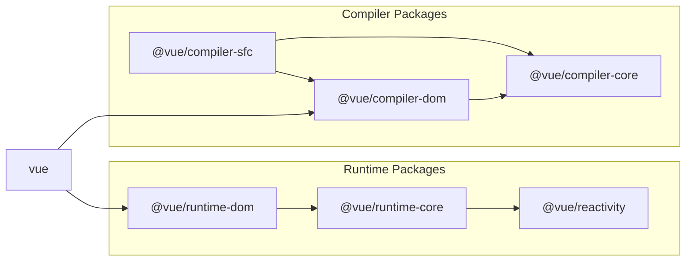

## 实现SFC解析器

## 准备工作

之前创建的插件示例已经不需要了，让我们把它删除。

```sh
pwd # ~
rm -rf ./plugin-sample
```

为了创建Vite插件，我们需要安装Vite本体。

```sh
pwd # ~
ni vite
```

关于插件的核心部分，由于它本来不属于vuejs/core的范围，我们将在packages目录中创建一个`@extensions`目录并在那里实现它。

```sh
pwd # ~
mkdir -p packages/@extensions/vite-plugin-chibivue
touch packages/@extensions/vite-plugin-chibivue/index.ts
```

`~/packages/@extensions/vite-plugin-chibivue/index.ts`

```ts
import type { Plugin } from 'vite'

export default function vitePluginChibivue(): Plugin {
  return {
    name: 'vite:chibivue',

    transform(code, id) {
      return { code }
    },
  }
}
```

从这里开始，我们将实现SFC编译器，但为了让大家更容易理解它的实际作用，我们先创建一个playground，边实现边运行测试。 
首先，让我们创建一个简单的SFC并加载它。

```sh
pwd # ~
touch examples/playground/src/App.vue
```

`examples/playground/src/App.vue`

```vue
<script>
import { reactive } from 'chibivue'
export default {
  setup() {
    const state = reactive({ message: 'Hello, chibivue!', input: '' })

    const changeMessage = () => {
      state.message += '!'
    }

    const handleInput = e => {
      state.input = e.target?.value ?? ''
    }

    return { state, changeMessage, handleInput }
  },
}
</script>

<template>
  <div class="container" style="text-align: center">
    <h2>{{ state.message }}</h2>
    
    <p><b>chibivue</b> is the minimal Vue.js</p>

    <button @click="changeMessage">click me!</button>

    <br />

    <label>
      Input Data
      <input @input="handleInput" />
    </label>

    <p>input value: {{ state.input }}</p>
  </div>
</template>

<style>
.container {
  height: 100vh;
  padding: 16px;
  background-color: #becdbe;
  color: #2c3e50;
}
</style>
```

`playground/src/main.ts`

```ts
import { createApp } from 'chibivue'
import App from './App.vue'

const app = createApp(App)

app.mount('#app')
```

`playground/vite.config.js`

```ts
import path from 'node:path'
import { fileURLToPath } from 'node:url'
import { defineConfig } from 'vite'

import chibivue from '../../packages/@extensions/vite-plugin-chibivue'

const dirname = path.dirname(fileURLToPath(new URL(import.meta.url)))

export default defineConfig({
  resolve: {
    alias: {
      chibivue: path.resolve(dirname, '../../packages'),
    },
  },
  plugins: [chibivue()],
})
```

现在让我们启动看看。


当然会出现错误。好极了（？）

## 解决错误

让我们开始解决这个错误。我们不会一开始就追求完美的实现。
首先，让我们将transform的对象限制为"*.vue"文件。
我们可以像sample中那样使用id进行分支处理，但既然vite提供了createFilter函数，我们就用它来创建过滤器吧。（没有特别的理由。）

`~/packages/@extensions/vite-plugin-chibivue/index.ts`

```ts
import type { Plugin } from 'vite'
import { createFilter } from 'vite'

export default function vitePluginChibivue(): Plugin {
  const filter = createFilter(/\.vue$/)

  return {
    name: 'vite:chibivue',

    transform(code, id) {
      if (!filter(id)) return
      return { code: `export default {}` }
    },
  }
}
```

我们创建了一个过滤器，如果是vue文件，就将文件内容transform为`export default {}`。
这样错误应该会消失，但屏幕上不会显示任何内容。

## 在compiler-sfc上实现解析器

这只是临时的解决方案，现在让我们实现一个正式的解析器。
vite-plugin的作用仅仅是让我们能够在使用vite时进行转换，而解析和编译器实际上是在vue的核心部分中实现的。
这就是`compiler-sfc`目录的作用。



https://github.com/vuejs/core/blob/main/.github/contributing.md#package-dependencies

无论是vite还是webpack，SFC编译器的核心部分都是相同的。这些实现就在`compiler-sfc`中。

让我们创建`compiler-sfc`。

```sh
pwd # ~
mkdir packages/compiler-sfc
touch packages/compiler-sfc/index.ts
```

在SFC编译中，我们使用`SFCDescriptor`对象来表示SFC。

```sh
touch packages/compiler-sfc/parse.ts
```

`packages/compiler-sfc/parse.ts`

```ts
import { SourceLocation } from '../compiler-core'

export interface SFCDescriptor {
  id: string
  filename: string
  source: string
  template: SFCTemplateBlock | null
  script: SFCScriptBlock | null
  styles: SFCStyleBlock[]
}

export interface SFCBlock {
  type: string
  content: string
  loc: SourceLocation
}

export interface SFCTemplateBlock extends SFCBlock {
  type: 'template'
}

export interface SFCScriptBlock extends SFCBlock {
  type: 'script'
}

export declare interface SFCStyleBlock extends SFCBlock {
  type: 'style'
}
```

没什么特别复杂的，只是用对象表示SFC的信息而已。

`packages/compiler-sfc/parse.ts`的作用是将SFC文件（字符串）解析为`SFCDescriptor`。
有人可能会想："哎呀，我们已经为模板解析器付出了那么多努力，现在又要创建一个解析器...真麻烦"，不用担心。
这里实现的解析器并不复杂。因为我们只需要组合之前创建的组件来分离template、script和style，所以很简单。

首先，作为准备工作，我们将之前创建的模板解析器导出。

`~/packages/compiler-dom/index.ts`

```ts
import { baseCompile, baseParse } from '../compiler-core'

export function compile(template: string) {
  return baseCompile(template)
}

// 导出解析器
export function parse(template: string) {
  return baseParse(template)
}
```

在compiler-sfc侧保存这些接口。

```sh
pwd # ~
touch packages/compiler-sfc/compileTemplate.ts
```

`~/packages/compiler-sfc/compileTemplate.ts`

```ts
import { TemplateChildNode } from '../compiler-core'

export interface TemplateCompiler {
  compile(template: string): string
  parse(template: string): { children: TemplateChildNode[] }
}
```

剩下的就是实现解析器了。

`packages/compiler-sfc/parse.ts`

```ts
import { ElementNode, NodeTypes, SourceLocation } from '../compiler-core'
import * as CompilerDOM from '../compiler-dom'
import { TemplateCompiler } from './compileTemplate'

/**
 * =========
 * 部分省略
 * =========
 */

export interface SFCParseOptions {
  filename?: string
  sourceRoot?: string
  compiler?: TemplateCompiler
}

export interface SFCParseResult {
  descriptor: SFCDescriptor
}

export const DEFAULT_FILENAME = 'anonymous.vue'

export function parse(
  source: string,
  { filename = DEFAULT_FILENAME, compiler = CompilerDOM }: SFCParseOptions = {},
): SFCParseResult {
  const descriptor: SFCDescriptor = {
    id: undefined!,
    filename,
    source,
    template: null,
    script: null,
    styles: [],
  }

  const ast = compiler.parse(source)
  ast.children.forEach(node => {
    if (node.type !== NodeTypes.ELEMENT) return

    switch (node.tag) {
      case 'template': {
        descriptor.template = createBlock(node, source) as SFCTemplateBlock
        break
      }
      case 'script': {
        const scriptBlock = createBlock(node, source) as SFCScriptBlock
        descriptor.script = scriptBlock
        break
      }
      case 'style': {
        descriptor.styles.push(createBlock(node, source) as SFCStyleBlock)
        break
      }
      default: {
        break
      }
    }
  })

  return { descriptor }
}

function createBlock(node: ElementNode, source: string): SFCBlock {
  const type = node.tag

  let { start, end } = node.loc
  start = node.children[0].loc.start
  end = node.children[node.children.length - 1].loc.end
  const content = source.slice(start.offset, end.offset)

  const loc = { source: content, start, end }
  const block: SFCBlock = { type, content, loc }

  return block
}
```

对于一直在实现解析器的各位来说，这应该很简单。
现在，让我们在插件端实际解析SFC文件。

`~/packages/@extensions/vite-plugin-chibivue/index.ts`

```ts
import { parse } from '../../compiler-sfc'

export default function vitePluginChibivue(): Plugin {
  //.
  //.
  //.
  return {
    //.
    //.
    //.
    transform(code, id) {
      if (!filter(id)) return
      const { descriptor } = parse(code, { filename: id })
      console.log(
        '🚀 ~ file: index.ts:14 ~ transform ~ descriptor:',
        descriptor,
      )
      return { code: `export default {}` }
    },
  }
}
```

这段代码是在vite运行的进程中执行的，也就是node环境，所以console输出应该在终端中显示。


/* 中间省略 */


看起来解析成功了！太好了！

到目前为止的源代码:  
[chibivue (GitHub)](https://github.com/chibivue-land/chibivue/tree/main/book/impls/10_minimum_example/070_sfc_compiler2) 