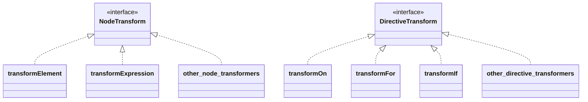

# 实现 Transformer 和重构 Codegen（基础模板编译器部分开始）

## 回顾现有实现

从现在开始，我们将更加深入地实现模板编译器。  
由于距离最小示例部分已经过了一段时间，让我们先回顾一下当前的实现是什么样的。  
主要关键词是 Parse、AST 和 Codegen。


```ts
export function baseCompile(
  template: string,
  option: Required<CompilerOptions>,
) {
  const ast = baseParse(template.trim())
  const code = generate(ast, option)
  return code
}
```

实际上，这个结构与 Vue.js 官方版本有些不同。  
让我们看一下官方代码。

https://github.com/vuejs/core/blob/37a14a5dae9999bbe684c6de400afc63658ffe90/packages/compiler-core/src/compile.ts#L61

你能看出来吗？

```ts
export function baseCompile(
  template: string,
  option: Required<CompilerOptions>,
) {
  const ast = baseParse(template.trim())
  transform(ast)
  const code = generate(ast, option)
  return code
}
```

就是这样的结构。

这次我们将实现这个 transform 函数。


## transform 是什么？

正如上述代码所示，transform 函数将解析得到的 AST 转换成某种形式。

如果你阅读这部分代码，可能会有一些了解：  
https://github.com/vuejs/core/blob/37a14a5dae9999bbe684c6de400afc63658ffe90/packages/compiler-core/src/ast.ts#L43C1-L51C23

这些以 VNODE_CALL 和 JS 开头命名的 AST 代码就是我们将要处理的内容。
Vue.js 的模板编译器将 AST 分为两种：一种是表示解析模板结果的 AST，另一种是表示要生成的代码的 AST。  
目前我们的实现只处理了前者。

考虑输入模板 `<p>hello</p>`。

首先，通过解析生成以下 AST。这部分与现有实现相同：

```ts
interface ElementNode {
  tag: string
  props: object /** 省略 */
  children: (ElementNode | TextNode | InterpolationNode)[]
}

interface TextNode {
  content: string
}
```

```json
{
  "tag": "p",
  "props": {},
  "children": [{ "content": "hello" }]
}
```

关于"表示要生成的代码的 AST"是什么样的，我们先考虑一下要生成的代码会是什么样的。
应该是这样的：

```ts
h('p', {}, ['hello'])
```

这就是表示要生成的代码的 AST。换句话说，它是表示应该生成的 JavaScript 的 AST，大致是这样的对象：

```ts
interface VNodeCall {
  tag: string
  props: PropsExpression
  children:
    | TemplateChildNode[] // multiple children
    | TemplateTextChildNode // single text child
    | undefined
}

type PropsExpression = ObjectExpression | CallExpression | ExpressionNode
type TemplateChildNode = ElementNode | InterpolationNode | TextNode
```

```json
{
  "tag": "p",
  "props": {
    "type": "ObjectExpression",
    "properties": []
  },
  "children": { "content": "hello" }
}
```

这样，"表示要生成的代码的 AST"就是 Codegen 过程中将生成的代码表示为 AST 的形式。
目前，这种分离可能看起来没有太大好处，但在实现指令等功能时会变得非常有用。
按照关注输入的 AST 和关注输出的 AST 来分开，`transform` 函数就是执行 `输入的 AST -> 输出的 AST` 转换的函数。

## Codegen Node

既然我们已经理解了流程，让我们再次确认我们要处理哪些 Node（我们想要转换成哪些 Node）。

最终我们将处理以下 Node：
https://github.com/vuejs/core/blob/37a14a5dae9999bbe684c6de400afc63658ffe90/packages/compiler-core/src/ast.ts#L43C1-L51C23

这些以"JS"开头的 Node 加上 VNODE_CALL 就是关注输出的 AST（以下称为 CodegenNode）。
但是，CodegenNode 并不是完全由这些 Node 组成的，而是包含 ElementNode、InterpolationNode 等来构成的。

下面列举我们将要处理的节点，并用注释解释。有些内容会略有简化，详细信息请参考源代码。

```ts
export interface SimpleExpressionNode extends Node {
  type: NodeTypes.SIMPLE_EXPRESSION
  content: string
  isStatic: boolean
  identifiers?: string[]
}

// 表示调用 h 函数的表达式的节点。
// 例如：`h("p", { class: 'message'}, ["hello"])`
export interface VNodeCall extends Node {
  type: NodeTypes.VNODE_CALL
  tag: string | symbol
  props: ObjectExpression | undefined // 注意：在源代码中实现为 PropsExpression（为了未来扩展）
  children:
    | TemplateChildNode[] // multiple children
    | TemplateTextChildNode
    | undefined
}

export type JSChildNode =
  | VNodeCall
  | ObjectExpression
  | ArrayExpression
  | ExpressionNode

// 表示 JavaScript 对象的节点。VNodeCall 的 props 等会持有它。
export interface ObjectExpression extends Node {
  type: NodeTypes.JS_OBJECT_EXPRESSION
  properties: Array<Property>
}
export interface Property extends Node {
  type: NodeTypes.JS_PROPERTY
  key: ExpressionNode
  value: JSChildNode
}

// 表示 JavaScript 数组的节点。VNodeCall 的 children 等会持有它。
export interface ArrayExpression extends Node {
  type: NodeTypes.JS_ARRAY_EXPRESSION
  elements: Array<string | Node>
}
```

## Transformer 的设计

在实现 transformer 之前，我们需要了解其设计。
首先，需要知道的是 transformer 有两种类型：NodeTransform 和 DirectiveTransform。
它们分别用于节点转换和指令转换，接口如下：

```ts
export type NodeTransform = (
  node: RootNode | TemplateChildNode,
  context: TransformContext,
) => void | (() => void) | (() => void)[]

// TODO:
// export type DirectiveTransform = (
//   dir: DirectiveNode,
//   node: ElementNode,
//   context: TransformContext,
// ) => DirectiveTransformResult;
export type DirectiveTransform = Function
```

DirectiveTransform 将在后面实现指令的章节中讨论，现在暂时定义为 Function。  
NodeTransform 和 DirectiveTransform 本质上都是函数，它们是用来转换 AST 的函数。  
请注意 NodeTransform 的返回值是函数。当实现 transform 时，如果函数返回了一个函数，这个函数会在节点转换后执行（称为 onExit 过程）。  
在节点转换应用后想执行的处理可以写在这里。这部分将在后面的 traverseNode 函数解释中一起说明。
接口的主要说明就是上述内容。

更具体的实现包括用于转换元素的 transformElement、用于转换表达式的 transformExpression 等。
DirectiveTransform 的实现则是各种指令的实现。
这些实现在 compiler-core/src/transforms 中。具体的转换处理就实现在这里。

https://github.com/vuejs/core/tree/37a14a5dae9999bbe684c6de400afc63658ffe90/packages/compiler-core/src/transforms

示意图 ↓



关于 context，TransformContext 包含转换过程中使用的信息和函数。  
以后会有更多添加，但现在只需要这些：

```ts
export interface TransformContext extends Required<TransformOptions> {
  currentNode: RootNode | TemplateChildNode | null
  parent: ParentNode | null
  childIndex: number
}
```

## Transformer 的实现

现在，让我们来看看 transform 函数的实际实现。首先从不依赖于具体转换处理的大框架开始。

结构非常简单，创建 context 并调用 traverseNode。
traverseNode 是转换的核心实现。

```ts
export function transform(root: RootNode, options: TransformOptions) {
  const context = createTransformContext(root, options)
  traverseNode(root, context)
}
```

在 traverseNode 中，基本上只是对节点应用存储在 context 中的 nodeTransforms（用于转换节点的函数集合）。  
对于有子节点的节点，也会对子节点调用 traverseNode。  
接口说明中提到的 onExit 也在这里实现。

```ts
export function traverseNode(
  node: RootNode | TemplateChildNode,
  context: TransformContext,
) {
  context.currentNode = node

  const { nodeTransforms } = context
  const exitFns = [] // 转换后要执行的处理
  for (let i = 0; i < nodeTransforms.length; i++) {
    const onExit = nodeTransforms[i](node, context)

    // 注册转换后要执行的处理
    if (onExit) {
      if (isArray(onExit)) {
        exitFns.push(...onExit)
      } else {
        exitFns.push(onExit)
      }
    }
    if (!context.currentNode) {
      return
    } else {
      node = context.currentNode
    }
  }

  switch (node.type) {
    case NodeTypes.INTERPOLATION:
      break
    case NodeTypes.ELEMENT:
    case NodeTypes.ROOT:
      traverseChildren(node, context)
      break
  }

  context.currentNode = node

  // 执行转换后的处理
  let i = exitFns.length
  while (i--) {
    exitFns[i]() // 可以执行那些假设转换已经完成的处理
  }
}

export function traverseChildren(
  parent: ParentNode,
  context: TransformContext,
) {
  for (let i = 0; i < parent.children.length; i++) {
    const child = parent.children[i]
    if (isString(child)) continue
    context.parent = parent
    context.childIndex = i
    traverseNode(child, context)
  }
}
```

接下来是具体的转换处理，这次我们将实现 transformElement 作为示例。

transformElement 主要将 NodeTypes.ELEMENT 类型的节点转换为 VNodeCall。

```ts
export interface ElementNode extends Node {
  type: NodeTypes.ELEMENT
  tag: string
  props: Array<AttributeNode | DirectiveNode>
  children: TemplateChildNode[]
  isSelfClosing: boolean
  codegenNode: VNodeCall | SimpleExpressionNode | undefined
}

// ↓↓↓↓↓↓ 转换 ↓↓↓↓↓↓ //

export interface VNodeCall extends Node {
  type: NodeTypes.VNODE_CALL
  tag: string | symbol
  props: PropsExpression | undefined
  children:
    | TemplateChildNode[] // multiple children
    | TemplateTextChildNode
    | undefined
}
```

这是对象到对象的转换，应该不会太难。我们可以阅读源代码并尝试实现。  
以下是我们这次将要实现的代码（指令的支持将在其他章节中处理）：

```ts
export const transformElement: NodeTransform = (node, context) => {
  return function postTransformElement() {
    node = context.currentNode!

    if (node.type !== NodeTypes.ELEMENT) return

    const { tag, props } = node

    const vnodeTag = `"${tag}"`
    let vnodeProps: VNodeCall['props']
    let vnodeChildren: VNodeCall['children']

    // props
    if (props.length > 0) {
      const propsBuildResult = buildProps(node)
      vnodeProps = propsBuildResult.props
    }

    // children
    if (node.children.length > 0) {
      if (node.children.length === 1) {
        const child = node.children[0]
        const type = child.type
        const hasDynamicTextChild = type === NodeTypes.INTERPOLATION

        if (hasDynamicTextChild || type === NodeTypes.TEXT) {
          vnodeChildren = child as TemplateTextChildNode
        } else {
          vnodeChildren = node.children
        }
      } else {
        vnodeChildren = node.children
      }
    }

    node.codegenNode = createVNodeCall(vnodeTag, vnodeProps, vnodeChildren)
  }
}

export function buildProps(node: ElementNode): {
  props: PropsExpression | undefined
  directives: DirectiveNode[]
} {
  const { props } = node
  let properties: ObjectExpression['properties'] = []
  const runtimeDirectives: DirectiveNode[] = []

  for (let i = 0; i < props.length; i++) {
    const prop = props[i]
    if (prop.type === NodeTypes.ATTRIBUTE) {
      const { name, value } = prop

      properties.push(
        createObjectProperty(
          createSimpleExpression(name, true),
          createSimpleExpression(value ? value.content : '', true),
        ),
      )
    } else {
      // directives
      // TODO:
    }
  }

  let propsExpression: PropsExpression | undefined = undefined
  if (properties.length) {
    propsExpression = createObjectExpression(properties)
  }

  return {
    props: propsExpression,
    directives: runtimeDirectives,
  }
}
```

## 基于转换后的 AST 进行 Codegen

既然我们已经将 AST 转换为适合 Codegen 的形式，我们也需要相应地调整 Codegen。
Codegen 接收的 AST 主要是 VNodeClass（及其包含的节点），我们需要编写代码以适应这种情况。
我们希望生成的最终字符串与之前相同。

现有的 Codegen 实现非常简单，所以在这里让我们使其更加规范一些（因为目前有很多硬编码的部分）。  
在 Codegen 中，我们也将使用 Codegen 专用的 context，并将生成的代码推送到其中。  
同时，我们也将在 context 中实现一些辅助函数（如缩进等）

```ts
export interface CodegenContext {
  source: string
  code: string
  indentLevel: number
  line: 1
  column: 1
  offset: 0
  push(code: string, node?: CodegenNode): void
  indent(): void
  deindent(withoutNewLine?: boolean): void
  newline(): void
}
```

关于实现细节，这里不详细说明，但基本上只是将功能按照各自的角色分成不同的函数，没有大的实现策略变化。
由于我们还没有实现指令的支持，所以有些临时实现已被移除，可能有些部分还不能工作，
但如果以下代码能够运行，那就没问题！

```ts
import { createApp, defineComponent, ref } from 'chibivue'

const App = defineComponent({
  setup() {
    const count = ref(0)
    return { count }
  },

  template: `
    <div class="container">
      <p> Hello World! </p>
      <p> Count: {{ count }} </p>
    </div>
  `,
})

const app = createApp(App)

app.mount('#app')
```

到此为止的源代码:  
[chibivue (GitHub)](https://github.com/chibivue-land/chibivue/tree/main/book/impls/50_basic_template_compiler/010_transformer) 