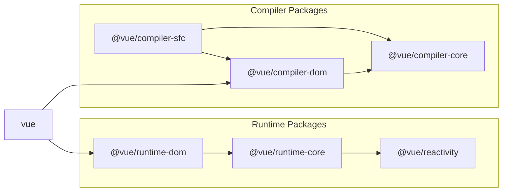

# Vue.js 的关键组成部分

## Vue.js 存储库

Vue.js 位于此存储库中。  
https://github.com/vuejs/core

实际上，这是一个 3.x 系列存储库，2.x 及更早版本位于另一个存储库中。
https://github.com/vuejs/vue

作为前提，这次我将使用 core 库作为参照（3.x 系列）。

## 构成 Vue.js 的核心组成部分

现在，我们首先简述一下 Vue.js 的实现。 Vue.js 存储库中有一个与贡献相关的 markdown 文件，所以如果你有时间，可以查看一下，找到很多有关仓库结构的信息。 （好吧，你不必看）

https://github.com/vuejs/core/blob/main/.github/contributing.md

粗略地说，Vue.js 有以下主要部分。

## runtime 运行时

runtime 运行时是影响实际运行的所有部分。无论是渲染还是组件状态管理。
它指的是使用 Vue.js 开发的、在浏览器或服务器（在 SSR 的情况下）上运行的 Web 应用程序的所有部分。
具体包括以下几个要素：（后面每章都会有详细的解释，所以这里会比较粗略）

### 响应式系统

它跟踪组件的状态并在状态发生变化时更新内容显示。
这种跟踪变化并执行更新的行为系统称为响应式系统。

```ts
import { ref } from "vue";

const count = ref(0);

// この関数が実行されるとcountを表示していた画面も更新される
const increment = () => {
  count.value++;
};
```

### 虚拟 DOM

Virtual DOM (虚拟 DOM) 也是 Vue.js 的核心模块之一。
Virtual DOM 在 JS 运行时定义了模仿真实 DOM 属性的 JavaScript 对象，并将其视为当前 DOM 对象，更新时将当前的 Virtual DOM 与新的 Virtual DOM 进行比较，仅将差分部分反映到真正的 DOM 中。
具体情况后面会用专门的章节进行详细解说。

### 组件

Vue.js 是一个面向组件的框架。            
您可以创建一些高度复用且可维护的组件，这些组件可以根据每个用户的需求进行二次封装或者使用。
它还在组件之间共享状态（props/emits、provide/inject 等）并提供生命周期钩子函数。
（如果您仔细考虑一下，即使您只是更改值，屏幕也会正确更新，这很奇怪。）

## 编译器

编译器是负责将开发者接口转换为内部实现的部分。

这里的“开发者接口”实际上指的是“使用 Vue.js 进行 Web 应用开发的开发人员编写的代码”与“Vue.js 真正的内部运行时代码”之间的边界部分。
具体来说，你可以想象一下你平时使用 Vue.js 编写的代码，Vue.js 内部都会有一个函数来转换和处理它，将其转换为真正可执行的 JavaScript 代码，那就没问题了。

实际上，在使用 Vue.js 进行开发时，都会有部分代码不属于纯粹的 JavaScript，例如 template 模板字符串或者 SFC 单文件组件等。
这些语法或者属性都是由 Vue.js 提供的，并且提供了一个函数（编译器）将其转换为纯 JavaScript 代码。
当然，这部分功能仅仅只在开发过程中使用，不属于 Web 应用程序实际运行的一部分（仅用于代码编译）。

编译器也分为两个部分：

### 模板编译 (编译器核心部分)

顾名思义，这是用来处理 template 模板部分的编译器。
具体包括了 v-if 或者 v-on 这类指令语法、开发者自定义组件的自闭合标签写法（写成 `<Counter />` 这类标签）以及 slot 插槽等。

### 单文件组件编译

顾名思义，这是用来处理 Single File Component（SFC， 单文件组件）的编译器。
这是一种扩展名为 .vue 的文件，它支持您在这个文件中编写 template 模板、script 脚本以及 css 层叠样式表。
它还提供了在 script 中使用的 defineComponent 方法以及 script setup 中的 defineProps 等语法宏（这个稍后会解释）。

实际上，这个 SFC 编译器是与 Webpack 或者 Vite 等工具一起组合使用的。
而作为其他工具的插件的实现部分，是没有存放在 core 库中的。core 中主要存放的是 SFC 编译器的核心功能部分，其他工具的插件适配则是在另外一个库中实现的。
(参考: [vitejs/vite-plugin-vue](https://github.com/vitejs/vite-plugin-vue))

顺便说一下，在这本书中我也会编写一个新的 Vite 插件，用来实现和支持我们自己编写的 SFC 编译器运行。

## vuejs/core 的主要文件目录

现在我们已经粗略的掌握了 Vue 的几个核心组成部分，那么来看看它实际的源代码是怎么样的吧（这里只是文件目录）。
Vue 中主要的源代码都存放在 packages 这个目录下。

https://github.com/vuejs/core/tree/main/packages

其中，我们需要注意以下内容：

- compiler-core
- compiler-dom
- compiler-sfc
- reactivity
- runtime-core
- runtime-dom
- vue

下面这张图中，体现了各个部分之间的依赖关系，方便我们加深理解。



https://github.com/vuejs/core/blob/main/.github/contributing.md#package-dependencies

<br/>
在本书中，我们将实现和解析这些目录中的所有内容。
